<script type="text/x-mathjax-config">
    MathJax.Hub.Config({
        tex2jax: { inlineMath: [['$','$'], ['$ ',' $']], processClass: 'math', processEscapes: true },
        'HTML-CSS': { linebreaks: { automatic: true } },
        SVG: { linebreaks: { automatic: true } }
        });
</script>
<script src="https://mathjax.cnblogs.com/2_7_2/MathJax.js?config=TeX-AMS-MML_HTMLorMML"></script>

# 第二周机器学习


>     本文公式显示需要使用Mathjax，然后令人悲伤的是github不支持Mathjax
>     您可以将这篇md文件pull下来，使用您本地的markdown解析器解析
>     没有必要在公示显示上浪费时间，您也可以下载我本地生成的html用浏览器打开即可
>     或者您也可以下载我上传到github上的pdf
*[Mathjax开源项目地址](https://github.com/mathjax/MathJax)*

## 关于机器学习的一些概念补充

###  深度学习与机器学习的关系

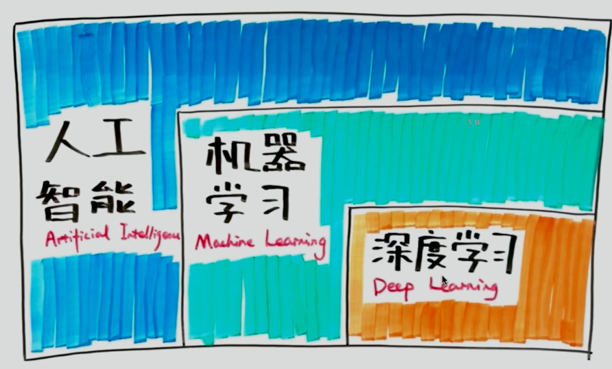
- 机器学习是实现人工只能的方法
- 深度学习是实现机器学习算法的技术

###  深度学习算法集合

- **卷积神经网络**
- **循环神经网络**
- 自动编码器
- 稀疏编码
- 深度信念网络
- 限制玻尔兹曼机
- 深度学习+强化学习 = 深度强化学习(AlphaGo)

###  深度学习进展
- 图像分类
- 机器翻译
- 图像生成
- AlphaGo

## Test and Debug Your ML System

### Debug the ML System
high bias(underfitting)/high variance(overfitting)  
Suppose you have implement regularized linear regressionto predict housing prices.  
$$
J(\theta) = \frac{1}{2m}[\sum_{i=1}^{m} (h_\theta(x^{(i)}) - (y^{(i)}) )^2 + \lambda \sum_{j=1}^m \theta_j^2]
$$
However,when you test your hypothesis on a new set of houses,you find that it makes unacceptably large errors in its prodiction,what should you try next?  
- Get more training examples - fixes high variance  
- Try smaller sets of features - fixes high variance
- Try getting additional features - fixes high bias
- Try adding polynomil features(多项式特征) - fixes high bias(eg. $ x_1^2,x_2^2,x_1x_2,etc $)
- Try decreasing $ \lambda $ - fixes high bias
- Try increasing $ \lambda $ - fixes high variance

### Machine learning diagnostic

A test you can run to gain insignt what is/isn't working with a learning algorithm,and gain guidance as to how best to improve its performance  
Diagnostics can take time to implement,but doing so can be a very good use of time.

### Evalating your hypothesis
将数据集(dataset)分为两类，一类叫Trainingset,一类叫Testset  
eg. 70% trainingset 30% Testset  

#### Training/testing procedure for linear regression
1. Learn parameter $ \theta $ from training data(minimizing training error $ J(\theta) $)
2. Compute testset error:
$$
J_{test}( \theta ) = \frac{1}{2m} \sum_{i=1}^{m_{test}}(h_\theta(x_{test}^{(i)}) - y_{test}^{(i)})^2
$$

#### Training/testing procedure for linear regression
1. Learn parameter $ \theta $ from training data(minimizing training error $ J(\theta) $)
2. Compute testset error:
$$
J_{test}( \theta ) = - \frac{1}{m_{test}} \sum_{i=1}^{m_{test}} [y_{test}^{(i)} \log (h_\theta(x_{test}^{(i)})) + (1 - y_{test}^{(i)}) \log (h_\theta(x_{test}^{(i)}))]
$$
3. Misclassification error (0/1 misclassification error)  

$$
err(h_\theta(x),y) = 
\begin{cases}
1,  &\text{if $h(\theta) \geq 0.5 $ , y = 0} \\\\
0, &\text{if $h(\theta) \lt 0.5$ , y = 1}
\end{cases}
$$
$$
error_{Test} = \frac{1}{m_{test}} \sum_{i=1}^{m_{test}}err(h_\theta(x_{test}^{(i)}),y_{test}^{(i)})
$$

## Advice for applying machine learning

### Model selection and training/validation/test sets

1. model selection
    1. $ h_\theta(x) = \theta_0 + \theta_1 x $ => $ \theta^{(1)} $
    2. $ h_\theta(x) = \theta_0 + \theta_1 x + \theta_2 x^2 $ => $ \theta^{(2)} $
    3. $ h_\theta(x) = \theta_0 + \theta_1 x + ... + \theta_3 x^3 $ => $ \theta^{(3)} $
    ...
    10. $ h_\theta(x) = \theta_0 + \theta_1 x + ... + \theta_{10} x^{10} $ => $ \theta^{(10)} $ 

这里需要计算 $ J_{test}(\theta^{(i)}) $,choose i，然后用 $ \theta^{(i)} $结合Testset计算各项指标显然不太合适。

2. 重新分组
这里引入cross validation  
eg. Training set 60%、cross valalidation set 20%、testset 20%  

Train/validation/test error  
Train error:
$$
J_{train}(\theta) = \frac{1}{2m_{train}}\sum_{i=1}^{m_{train}} (h_\theta(x^{(i)}) - y_{train}^{(i)})^2
$$
Cross Valadation error:  
$$
J_{cv}(\theta) = \frac{1}{2m_{cv}}\sum_{i=1}^{m_{cv}} (h_\theta(x^{(i)}) - y_{cv}^{(i)})^2
$$
Test error:  
$$
J_{test}(\theta) = \frac{1}{2m_{test}}\sum_{i=1}^{m_{test}} (h_\theta(x^{(i)}) - y_{test}^{(i)})^2
$$
重新计算$ \theta^{(1)}、\theta^{(2)}、...、\theta^{(10)} $
Then $ J_{cv}(\theta^{(1)}) $、$ J_{cv}(\theta^{(2)}) $、...、 $ J_{cv}(\theta^{(10)}) $
挑选出 $ \theta^{(i)} $


Note: 
>   有的交叉验证方式是这样的(这种也很常用)
>   这里我们把训练集等分成N分(以N=3为例)
>   假设已经随机分成了三组
>   A+B->M1 P1(A和B作为trainingset训练出模型M1，用C作为cross validation set作验证，得到某一个项指标P1）
>   A+C->M2 P2
>   B+C->M3 P3
>   该指标最终值 P = (P1+P2+P3)/3

### Regularization and bias/variance

#### Linear regression with regularization
假设我们已经通过上一节课的学习获得了Model:$ h_\theta(x) = \theta_0 + \theta_1 x + \theta_2 x^2 + \theta_3 x^3 + \theta_4 x^4 $  ①
这时我们要加上正则项  
$$
J(\theta)  = \frac{1}{2m} \sum_{i=1}^{m} (h_\theta(x^{(i)}) - y^{(i)})^2 +  \frac{\lambda}{2m} \sum_{j=1}^{\lambda} \theta_j^2 \text{②}
$$
我们面临这样一个问题，$ \lambda $ 过小会出现underfit, $ \lambda $ 过大会出现overfit 
Q:How can we automatically choose a good value for the regulatization parameter lambda?
Train error:
$$
J_{train}(\theta) = \frac{1}{2m_{train}}\sum_{i=1}^{m_{train}} (h_\theta(x^{(i)}) - y_{train}^{(i)})^2 \\\\
J_{cv}(\theta) = \frac{1}{2m_{cv}}\sum_{i=1}^{m_{cv}} (h_\theta(x^{(i)}) - y_{cv}^{(i)})^2 \\\\
J_{test}(\theta) = \frac{1}{2m_{test}}\sum_{i=1}^{m_{test}} (h_\theta(x^{(i)}) - y_{test}^{(i)})^2
$$
我们可以将 $ \lambda=0、0.01、0.02、0.04...10$代入①②两式计算$ \min\limits_{\theta} J(\theta) $ ,然后用$ J_{cv}(\theta) $验证选出最小的$ \lambda $,最后用$ J_{test}(\theta) $检查误差
Estimate generalization error for testset $ J_{test}(\theta^{(i)}) $  
$J_{cv}(\theta)$会随着$ \lambda $的增大先减小后增大  
$J_{train}(\theta)$会随着$ \lambda $的增大而增大  

### Learning curve
学习曲线就是通过画出不同训练集大小时训练集和交叉验证的准确率，可以看到模型在新数据上的表现，进而来判断模型是否方差偏高或偏差过高，以及增大训练集是否可以减小过拟合。

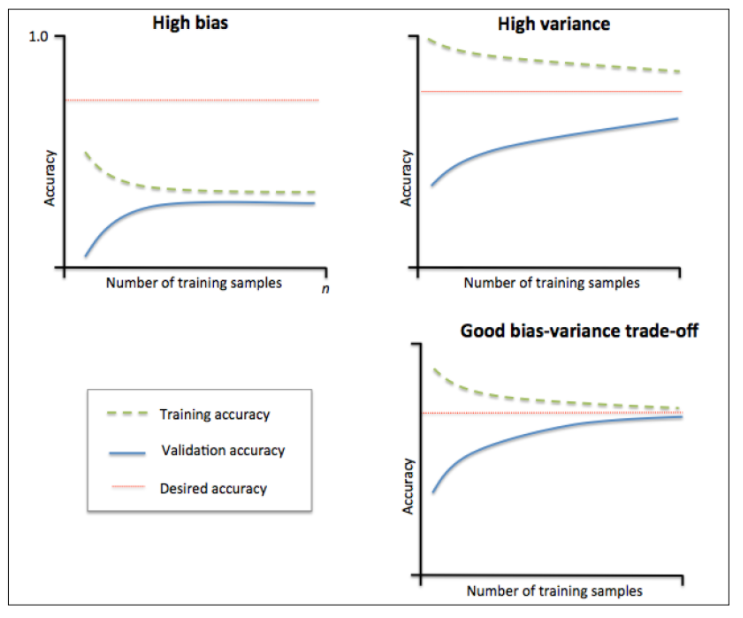

当训练集和测试集的误差收敛但却很高时，为高偏差。  
左上角的偏差很高，训练集和验证集的准确率都很低，很可能是欠拟合。  
我们可以增加模型参数，比如，构建更多的特征，减小正则项。  
此时通过增加数据量是不起作用的。  


当训练集和测试集的误差之间有大的差距时，为高方差。  
当训练集的准确率比其他独立数据集上的测试结果的准确率要高时，一般都是过拟合。  
右上角方差很高，训练集和验证集的准确率相差太多，应该是过拟合。  
我们可以增大训练集，降低模型复杂度，增大正则项，或者通过特征选择减少特征数。  
理想情况是是找到偏差和方差都很小的情况，即收敛且误差较小


参考博客
>	作者：不会停的蜗牛
>	链接：https://www.jianshu.com/p/d89dee94e247

### Priority what to work on: Spam classfication example
待整理
###Error metrics for skewed classes
待整理
### Trading off presion and recall
待整理
### Diagnosing bias vs variance
待整理
### Data for machine learning
待整理


## Decision tree (决策树)

> 这一章没有看吴恩达老师的视频，看的是中科院某博士讲的
> 决策树属于分类算法，分类算法还有比如朴素贝叶斯、SVM、.随机森林、k-近邻（KNN）
> 关于几种分类算法，参考博客 [https://www.cnblogs.com/Zhi-Z/p/8912396.html](https://www.cnblogs.com/Zhi-Z/p/8912396.html)
> 参考链接 [http://www.cnblogs.com/leoo2sk/archive/2010/09/19/decision-tree.html](http://www.cnblogs.com/leoo2sk/archive/2010/09/19/decision-tree.html)
> 决策树分类算法属于监督学习（Supervised learning）
### 树模型

- 决策树 ： 从根节点开始一步步走到叶子节点
- 所有的数据最终都会落到叶子节点，既可以做分类也可以回归
- 数的组成
	1. 根节点：第一个选择点
	2. 非叶子节点与分支：中间过程
	3. 叶子节点：最终的决策结果
- 节点
	1. 增加节点相当于在数据中切一刀
### 决策树的训练与测试
- 训练阶段：从给定的训练集构造，出来一个树（从根节点开始选择特征，那么应该如何进行切分呢？）
- 测试阶段：一旦构造好了决策树，那么分类或者预测任务就很简单了，只需要走一遍就可以了。那么难点在于如何构造出来一棵树。

#### 如何切分特征(选择节点)

Q：根节点的选择该用哪个特征？  
通过一种衡量标准，来计算通过不同特征进行分支选择后的分类情况，找出来最好的那个当做根节点，以此类推。
#### 衡量标准-熵
- 熵：熵是表示随机变量不确定的度量（值越大表示越乱)

- 公式：$ H(X) = -\sum_{i=1}^{m} p_i * \log(p_i) ​$
  - 举例：A={1,1,1,1,1,1,2} B={1,2,3,4,5,6,7}
  - $ H_A(X) = -\frac{6}{7} \log_{2}(\frac{6}{7}) -\frac{1}{7}\log_{2}(\frac{1}{7}) = 0.59 ​$
  - $ H_B(X) = - 7\frac{1}{7}*\log_{2}(\frac{1}{7}) = 2.81 $

 - 不确定性越大，得到熵的值就越大

  - 当p=0 or p=1是 H(p) = 0,随机变量完全没有不确定性

  - 当p=  0.5时，此时随机变量的不确定性最大

    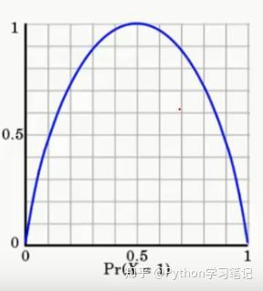

- 信息增益：表示特征X使得类Y的不确定性减少的程序（分类后的专一性，希望分类后的结果是同类在一起）
  计算实例：  
  数据：14天打球情况、特征：4种环境变化、目标：构造决策树

  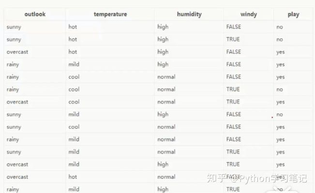

  划分方式：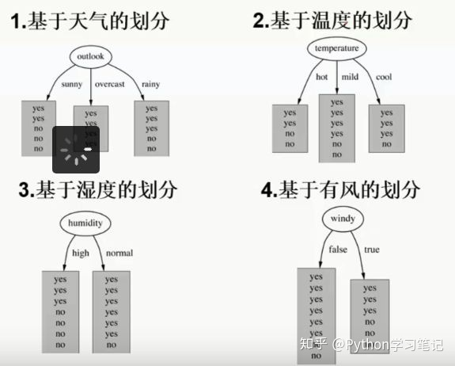 
  Q：选谁当根节点？
  ANS：根据信息增益
  在历史数据中（14天）有9天打球，5天不打球，所以此时的熵应为： $ -\frac{9}{14}\log_2(\frac{9}{14})-\frac{5}{14}\log_2(\frac{5}{14}) = 0.940 $
  
  4个特征逐一分析，先从outlook特征开始：  
  - outlook=sunny时，熵值为0.971
  - outlook=overcast时，熵值为0
  - outlook=rainy时，熵值为0.971
  根据数据统计，outlook取值分别为sunny,overcast,rainy的概率分别为：5/14,4/14,5/14
  熵值计算：5/14 * 0.971 + 4/14 * 0 + 5/14 * 0.971 = 0.693
  信息增益：系统的熵值从原始的0.940下降到了0.693，增益为0.247
  同样的方式可以计算出其他特征的信息增益，那么我们选择最大的那个就可以啦

### 决策树算法
如何切分特征的算法不仅仅局限于信息增益，目前常用算法有三种，分别是:  
1. 信息增益法(ID3算法)
2. 信息增益率(C4.5算法、解决ID3问题，考虑自身熵)
3. CART算法：既可以做分类，也可以做回归。只能形成二叉树。使用GINI系数做衡量标准
	- GINI系数：$  gini(T) = 1 - \sum p_j^2 = 1 -  \sum (\frac{n_j}{S})^2 $
	- $ p_j $为类别j在样本T中出现的频率
	- $ N_j $为样本T中类别j的个数
	- S为T中的样本个数

### 决策树剪枝策略
- 为什么要剪枝：决策树过拟合风险很大，理论上可以完全分得开数据
- 剪枝策略：预剪枝、后剪枝
- 预剪枝：边建立决策树边进行剪枝的操作
- 后剪枝：当建立完决策树后再来进行剪枝操作

###Code

> [Code 参考博客链接](https://www.cnblogs.com/pinard/p/6056319.html)

```Python
#!/usr/bin/python
# -*- coding: UTF-8 -*-

import pandas as pd
import matplotlib.pyplot as plt
# 这里我们使用scikit-learn(sklearn)作为我们机器学习的模块
from sklearn.datasets.california_housing import fetch_california_housing
from sklearn import tree
import pydotplus
from io import BytesIO
from sklearn.model_selection import train_test_split
from sklearn.model_selection import GridSearchCV
from sklearn.ensemble import RandomForestRegressor

house_data = fetch_california_housing()
# print(house_data.DESCR)

# 定义树的最大深度等于2
dtr = tree.DecisionTreeRegressor(max_depth=2)
dtr.fit(house_data.data[:, [6, 7]], house_data.target)


dot_data = \
    tree.export_graphviz(dtr,
                         out_file=None,
                         feature_names=house_data.feature_names[6:8],
                         filled=True,
                         impurity=False,
                         rounded=True
                         )
#
graph = pydotplus.graph_from_dot_data(dot_data)
graph.get_nodes()[7].set_fillcolor('#FFF2DD')
img_data = graph.create_png()
plt.imshow(plt.imread(BytesIO(img_data)))
# plt.show()
# graph.write_png('dtr_white_background.png')

# 拆分训练集 测试集
# 取0.1作为测试集
data_train, data_test, target_train,target_test = \
    train_test_split(house_data.data, house_data.target, test_size = 0.1,random_state = 42)
dtr = tree.DecisionTreeRegressor(random_state = 42)
dtr.fit(data_train, target_train)
print(dtr.score(data_test, target_test))


# 使用GridSearchCV帮助我们选择合适参数
tree_param_grid = {'min_samples_split': list((3, 6, 9)), 'n_estimators': list((10, 50, 100))}
grid = GridSearchCV(RandomForestRegressor(), param_grid=tree_param_grid, cv=5)
grid.fit(data_train, target_train)
print(grid.grid_scores_, grid.best_score_, grid.best_params_)

```

运行结果

```
0.637355881715626
(0.8074196516933743, {'min_samples_split': 6, 'n_estimators': 100})
```


## Ensemble learning(集成算法)
>	Note：集成算法并不是机器学习算法的一种，而相当于把很多个机器学习算法拢在一块。

### Ensemble learning介绍
- Ensemble learning
  - 目的：让机器学习效果更好，单个不行，那就一群
  - Bagging: 训练多个分类器取平均：$ f(x) = \frac{1}{M} \sum_{m=1}^M f_m(x)​$
  - Boosting：从弱学习器开始加强，通过加权来进行训练
    - $ F_m(x) = F_{m-1}(x) + argmin_h\sum_{i=1}^n L(y_i,F_{m-1}(x_i)+h(x_i))  ​$ 加入一个数，要比原来强
  - Stacking:聚合多个分类和回归模型（可以分阶段来做)

### Bagging模型

- 全称：bootstrap aggregation(说白了就是并行训练一堆分类器)
- 最典型的代表就是随机森林
- 随机：数据采样随机(一般取60%-80%，有放回)，特征选择随机（获得一系列随机的树以后对当中特征也按照60%-80%进行采样）
- 之所以要进行随机，是要保证泛化能力
- 森林：很多决策树并行放在一起
- 理论上越多的树效果会越好，但实际上基本超过一定数量就差不多上下浮动了

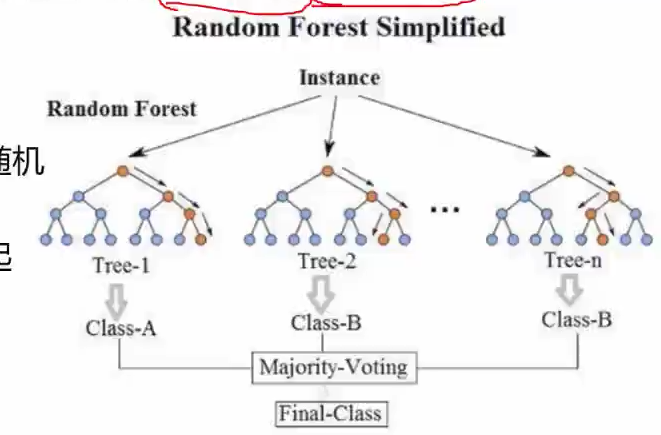

#### 随机森林优势
- 可以处理很多维度(feature很多)的数据，并且不用做特征选择
- 在训练完后，它能够给出哪些feature比较重要
- 容易做成并行化方法，速度比较快
- 可以进行可视化展示，便于分析

### Boosting模型
- 典型代表：AdaBoost，Xgboost
- Adaboost会根据前一次的分类效果调整数据权重
- 解释：如果某一个数据在这次分错了，那么下一次就会给他更大的权重
- 结果：每个分类器根据自身准确性来确定各自的权重，再合体

### Stacking模型
- 堆叠：很暴力，拿来一堆直接上
- 可以堆叠各种各样的分类器（KNN、SVM、RF等）
- 分阶段：第一阶段得出各自结果，第二阶段再用前一阶段结果训练
- 为了刷结果，不择手段

堆叠在一起确实能使得准确率得到提升，但是速度是个问题  
集成算法是竞赛与论文神奇，当我们更关注与结果时不妨来试试！


## 卷及神经网络入门

### 传统神经网络问题
- 参数过多
	- 举例
		- 假设图像大小1000*1000
		- 假设下一层神经元为10^6
		- 全连接参数为1000*1000*10^6 = 10^12 
		- 容易过拟合，需要更多训练数据
	- 解决方案-局部连接
	- 	- 原理:图像的区域性
		- 举例
            - 图像大小 1000*1000
            - 下一层神经元为10^6
            - 局部连接范围为10*10
            - 全连接参数为10*10*10^6 = 10^8
	- 解决方案 参数共享
	- 	- 原理:图像特征与位置无关
		- 举例
			- 图像大小1000*1000
			- 下一层神经元为10^6
			- 局部连接范围为10*10
			- 全链接参数为10*10 = 10^2
### 卷积
设图像f(x),模板是g(x),然后将模版g(x)在模版中移动,每到一个位置,就把f(x)与g(x)的定义域相交的元素进行乘积并且求和,得出新的图像一点,就是被卷积后的图像. 模版又称为卷积核.卷积核做一个矩阵的形状.
输出size = 输入size - 卷积核size+(1,1)

步长的概念:模板在图像上每一次移动的个数。  
定义几个参数:  

- 输入图片大小 W×W
- Filter大小 F×F
- 步长 S
- padding的像素数 P
padding是在图像的周围补0  
padding的大小应该是使输出size不变
输出图片大小为
$$
N =\frac{(W − F + 2P )}{S}+1
$$

对于多通道图像，卷积Filter维度大小也跟着通道数扩大即可，这样我们就可以得到一个单通道卷积和。那该如何获得多通道的图像卷积呢？此时我们应该是使用多张卷积核。  
多个卷积核的物理含义是提取图像中的多种特征

Q：卷基层，输入三通道，输出192通道，卷积核大小是3*3，问该卷基层有多少参数？
A：(3*(3*3)) * 192 = 5184

卷积运算示例：  
1. 3 * 3 的像素区域R**与****卷积**核G的**卷积**运算：

2. R5(中心像素)=R1G1 + R2G2 + R3G3 + R4G4 + R5G5 + R6G6 + R7G7 + R8G8 + R9G9

   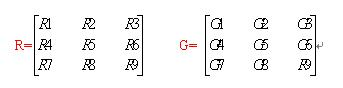

### 激活函数

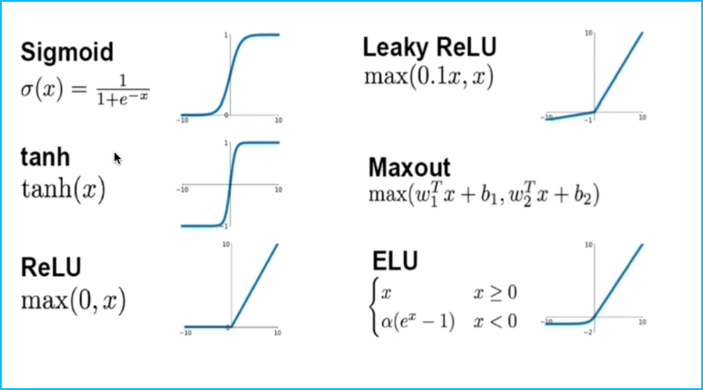

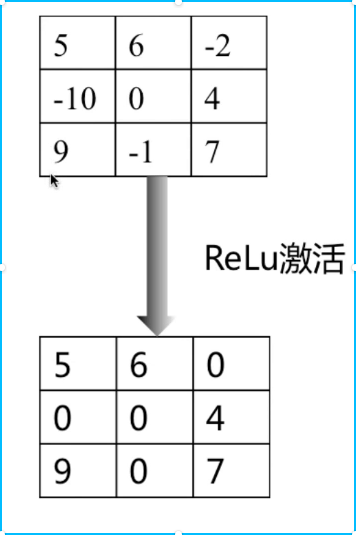

### 池化

#### 最大化池化

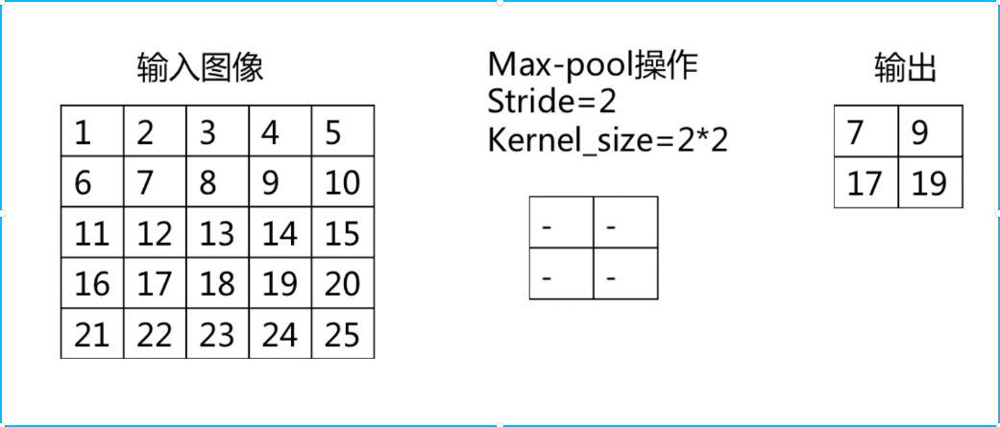

#### 平均值池化

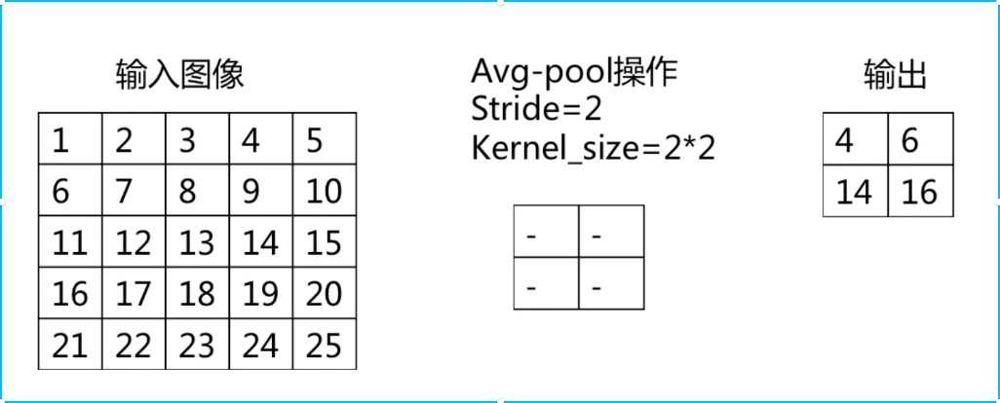

- 使用时不重叠、不补零
- 没有用于求导的参数
- 池化层的参数为步长和池化核大小
- 用于减小图像尺寸，从而减少计算量
- 一定程度解决平移鲁棒性


### 全连接

- 将上一层输出展开并连接到每一个神经元上
- 全连接层之后可以加全连接层，但是不可以加卷积层、池化层
- 全连接层即标准神经网络的层
- 相比卷积层，参数数目较大，占比比较大
- 参数数目 = 输入通道数目*输出通道数目

### 卷积神经网络结构

- 卷积神经网络=卷积层+池化层+全连接层

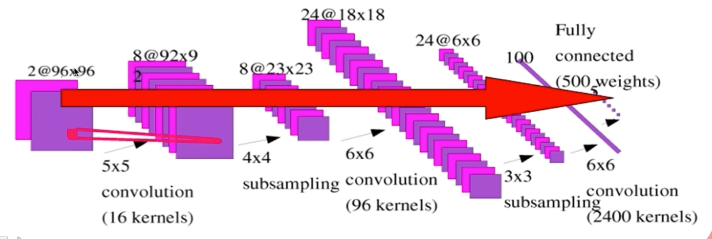


- 全卷积神经网络=卷积层+池化层

  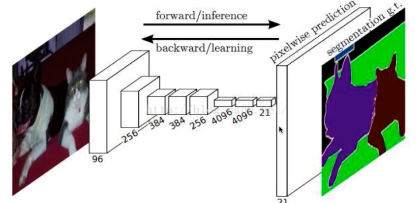


### Code

最刺激的事情来了，如果之前没用过卷积神经网络的话，这里我们使用卷及神经网络对cifar-10图像数据进行分类

先加上三层隐藏层实现一个标准多层神经网络
```Python
#!/usr/bin/env python
# coding: utf-8


import tensorflow as tf
import os
import pickle
import numpy as np


CIFAT_DIR = '../cifar-10-batches-py'
print(os.listdir(CIFAT_DIR))


def load_data(filename):
    """read data from data file"""
    with open(os.path.join(filename), 'rb') as f:
        # data = pickle.load(f, encoding='bytes')

        # Python2.7代码
        data = pickle.load(f)
        return data['data'], data['labels']


class CifarData:
    def __init__(self, filenames, need_shuffle):
        all_data = []
        all_labels = []
        # 关于zip函数 具体看
        # http://www.cnblogs.com/frydsh/archive/2012/07/10/2585370.html
        for filename in filenames:
            data, labels = load_data(filename)
            for item, label in zip(data, labels):
                all_data.append(item)
                all_labels.append(label)
        # 关于 vstack函数
        # https://www.cnblogs.com/nkh222/p/8932369.html
        self._data = np.vstack(all_data)
        # 归一化处理
        self._data = self._data / 127.5 - 1;
        self._labels = np.hstack(all_labels)
        print(self._data.shape)
        print(self._labels.shape)
        self._num_examples = self._data.shape[0]
        self._need_shuffle = need_shuffle
        self._indicator = 0
        if self._need_shuffle:
            self._shuffle_data()

    def _shuffle_data(self):
        # 【0,1,2,3,4】 => [2,1,3,4,0]
        p = np.random.permutation(self._num_examples)
        self._data = self._data[p]
        self._labels = self._labels[p]

    def next_batch(self, batch_size):
        """return batch_size examples as a batch """
        end_indicator = self._indicator + batch_size
        if end_indicator > self._num_examples:
            if self._need_shuffle:
                self._shuffle_data()
                self._indicator = 0
                end_indicator = batch_size
            else:
                raise Exception("have no more examples")
        if end_indicator > self._num_examples:
            raise Exception('batch size is larger than all examles')
        batch_data = self._data[self._indicator: end_indicator]
        batch_labels = self._labels[self._indicator: end_indicator]
        self._indicator = end_indicator
        return batch_data, batch_labels


train_filenames = [os.path.join(CIFAT_DIR, 'data_batch_%d' % i) for i in range(1, 6)]
test_filenames = [os.path.join(CIFAT_DIR, 'test_batch')]

train_data = CifarData(train_filenames, True)
test_data = CifarData(test_filenames, False)
# batch_data, batch_labels = train_data.next_batch(10)
# print(batch_data,batch_labels)


# None 代表输入样本数是不确定的
x = tf.placeholder(tf.float32, [None, 3072])
# None
y = tf.placeholder(tf.int64, [None])

'''
# (3072,10)
w = tf.get_variable('w', [x.get_shape()[-1], 10], initializer=tf.random_normal_initializer(0, 1))
# (10, )
b = tf.get_variable('b', [10], initializer=tf.constant_initializer(0.0))
# [None,3072] *[3072,10] = [None,10]
y_ = tf.matmul(x, w) + b
'''

hidden1 = tf.layers.dense(x, 100, activation=tf.nn.relu)
hidden2 = tf.layers.dense(hidden1, 50, activation=tf.nn.relu)
hidden3 = tf.layers.dense(hidden2, 10, activation=tf.nn.relu)

# 这里10表示神经元个数 这个函数就等价于上面写的那么多代码
y_ = tf.layers.dense(hidden3, 10)


# y_->softmax
# y -> one_hot
# loss = ylogy_
loss = tf.losses.sparse_softmax_cross_entropy(labels=y,logits=y_)


'''
# [None,10]
p_y_1 = tf.nn.sigmoid(y_)
# 这里-1参数表示缺省值 保证为1列即可
y_reshaped = tf.reshape(y, (-1, 1))
y_reshaped_float = tf.cast(y_reshaped, tf.float32)
# 计算loss
loss = tf.reduce_mean(tf.square(y_reshaped_float - p_y_1))
'''

# indices
predict = tf.argmax(y_, 1)
correct_prediction = tf.equal(predict, y)
accuracy = tf.reduce_mean(tf.cast(correct_prediction, tf.float64))

with tf.name_scope('train_op'):
    # 这里1e-3是学习率 learning rate AdamOptimizer是梯度下降的一个变种
    train_op = tf.train.AdamOptimizer(1e-3).minimize(loss)

'''
到此为止我们的计算图搭建完成
'''

init = tf.global_variables_initializer()
batch_size = 20
train_steps = 10000
test_steps = 100

with tf.Session() as sess:
    sess.run(init)
    for i in range(train_steps):
        batch_data, batch_labels = train_data.next_batch(batch_size)
        loss_val, accu_val, _ = sess.run(
            [loss, accuracy, train_op],
            feed_dict={x: batch_data, y: batch_labels})
        if (i+1) % 500 == 0:
            print('[Train] Step: %d, loss: %4.5f,acc: %4.5f' % (i+1, loss_val, accu_val))
        if(i+1) % 5000 == 0:
            test_data = CifarData(test_filenames, False)
            all_test_acc_val = []
            for j in xrange(test_steps):
                test_batch_data, test_batch_labels \
                 = test_data.next_batch(batch_size)
                test_acc_val = sess.run(
                    [accuracy],
                    feed_dict={
                        x: test_batch_data,
                        y: test_batch_labels
                    }
                )
                all_test_acc_val.append(test_acc_val)
            test_acc = np.mean(all_test_acc_val)
            print('[Test] Step: %d, acc: %4.5f ' % (i+1, test_acc))
```
然后使用卷积和池化进行图像数据处理，搭建一个简单卷积神经网络
```Python
#!/usr/bin/env python
# coding: utf-8


import tensorflow as tf
import os
import pickle
import numpy as np


CIFAT_DIR = '../cifar-10-batches-py'
print(os.listdir(CIFAT_DIR))


def load_data(filename):
    """read data from data file"""
    with open(os.path.join(filename), 'rb') as f:
        # data = pickle.load(f, encoding='bytes')

        # Python2.7代码
        data = pickle.load(f)
        return data['data'], data['labels']


class CifarData:
    def __init__(self, filenames, need_shuffle):
        all_data = []
        all_labels = []
        # 关于zip函数 具体看
        # http://www.cnblogs.com/frydsh/archive/2012/07/10/2585370.html
        for filename in filenames:
            data, labels = load_data(filename)
            for item, label in zip(data, labels):
                all_data.append(item)
                all_labels.append(label)
        # 关于 vstack函数
        # https://www.cnblogs.com/nkh222/p/8932369.html
        self._data = np.vstack(all_data)
        # 归一化处理
        self._data = self._data / 127.5 - 1;
        self._labels = np.hstack(all_labels)
        print(self._data.shape)
        print(self._labels.shape)
        self._num_examples = self._data.shape[0]
        self._need_shuffle = need_shuffle
        self._indicator = 0
        if self._need_shuffle:
            self._shuffle_data()

    def _shuffle_data(self):
        # 【0,1,2,3,4】 => [2,1,3,4,0]
        p = np.random.permutation(self._num_examples)
        self._data = self._data[p]
        self._labels = self._labels[p]

    def next_batch(self, batch_size):
        """return batch_size examples as a batch """
        end_indicator = self._indicator + batch_size
        if end_indicator > self._num_examples:
            if self._need_shuffle:
                self._shuffle_data()
                self._indicator = 0
                end_indicator = batch_size
            else:
                raise Exception("have no more examples")
        if end_indicator > self._num_examples:
            raise Exception('batch size is larger than all examles')
        batch_data = self._data[self._indicator: end_indicator]
        batch_labels = self._labels[self._indicator: end_indicator]
        self._indicator = end_indicator
        return batch_data, batch_labels


train_filenames = [os.path.join(CIFAT_DIR, 'data_batch_%d' % i) for i in range(1, 6)]
test_filenames = [os.path.join(CIFAT_DIR, 'test_batch')]

train_data = CifarData(train_filenames, True)
test_data = CifarData(test_filenames, False)
# batch_data, batch_labels = train_data.next_batch(10)
# print(batch_data,batch_labels)


# None 代表输入样本数是不确定的
x = tf.placeholder(tf.float32, [None, 3072])
# None
y = tf.placeholder(tf.int64, [None])

# -1代表缺省 实际上x的维度应该理解为4维
x_image = tf.reshape(x, [-1,3,32,32])
x_image = tf.transpose(x_image, perm = [0,2,3,1])

# 卷积层
# conv1 ：神经元图、feature_map、输出图像
# padding = 'same|valid' same即使用padding
# 32*32
conv1 = tf.layers.conv2d(x_image,
                        32, # 表示输出空间的维数（即卷积过滤器的数量）
                        (3,3),
                        padding = 'same',
                        activation = tf.nn.relu,
                        name = 'conv1')
# 16 * 16
pooling1 = tf.layers.max_pooling2d(conv1,
                                   (2,2), # kernel size
                                   (2,2), # stride 表示卷积的纵向和横向的步长
                                   name = 'pool1')

conv2 = tf.layers.conv2d(pooling1,
                        32,
                        (3,3),
                        padding = 'same',
                        activation = tf.nn.relu,
                        name = 'conv2')
# 8 * 8
pooling2 = tf.layers.max_pooling2d(conv2,
                                   (2,2), # kernel size
                                   (2,2), # stride
                                   name = 'pool2')

conv3 = tf.layers.conv2d(pooling2,
                        32,
                        (3,3),
                        padding = 'same',
                        activation = tf.nn.relu,
                        name = 'conv3')

# 4 * 4* 32
pooling3 = tf.layers.max_pooling2d(conv3,
                                   (2,2), # kernel size
                                   (2,2), # stride
                                   name = 'pool3')
# [None,4*4*32]
flatten = tf.layers.flatten(pooling3)


# 这里10表示神经元个数 这个函数就等价于上面写的那么多代码
y_ = tf.layers.dense(flatten, 10)


# y_->softmax
# y -> one_hot
# loss = ylogy_
loss = tf.losses.sparse_softmax_cross_entropy(labels=y,logits=y_)


'''
# [None,10]
p_y_1 = tf.nn.sigmoid(y_)
# 这里-1参数表示缺省值 保证为1列即可
y_reshaped = tf.reshape(y, (-1, 1))
y_reshaped_float = tf.cast(y_reshaped, tf.float32)
# 计算loss
loss = tf.reduce_mean(tf.square(y_reshaped_float - p_y_1))
'''

# indices
predict = tf.argmax(y_, 1)
correct_prediction = tf.equal(predict, y)
accuracy = tf.reduce_mean(tf.cast(correct_prediction, tf.float64))

with tf.name_scope('train_op'):
    # 这里1e-3是学习率 learning rate AdamOptimizer是梯度下降的一个变种
    train_op = tf.train.AdamOptimizer(1e-3).minimize(loss)

'''
到此为止我们的计算图搭建完成
'''

init = tf.global_variables_initializer()
batch_size = 20
train_steps = 1000
test_steps = 100

with tf.Session() as sess:
    sess.run(init)
    for i in range(train_steps):
        batch_data, batch_labels = train_data.next_batch(batch_size)
        loss_val, accu_val, _ = sess.run(
            [loss, accuracy, train_op],
            feed_dict={x: batch_data, y: batch_labels})
        if (i+1) % 500 == 0:
            print('[Train] Step: %d, loss: %4.5f,acc: %4.5f' % (i+1, loss_val, accu_val))
        if(i+1) % 5000 == 0:
            test_data = CifarData(test_filenames, False)
            all_test_acc_val = []
            for j in xrange(test_steps):
                test_batch_data, test_batch_labels \
                 = test_data.next_batch(batch_size)
                test_acc_val = sess.run(
                    [accuracy],
                    feed_dict={
                        x: test_batch_data,
                        y: test_batch_labels
                    }
                )
                all_test_acc_val.append(test_acc_val)
            test_acc = np.mean(all_test_acc_val)
            print('[Test] Step: %d, acc: %4.5f ' % (i+1, test_acc))
```
## 卷积神经网络进阶

### 不同网络结构
- 不同的网络结构解决的问题不同
- 不同的网络结构使用的技巧不同
- 不同的网络结构应用的场景不同

### 模型的进化
- 更深更宽 - AlexNex到VGGNet
- 不同的模型结构 - VGG到Inception/ResNet
- 优势组合-Inception+Res = InceptionResNet
- 自我学习-NASNet
- 实用-MobileNet

### AlexNet

#### 网络结构

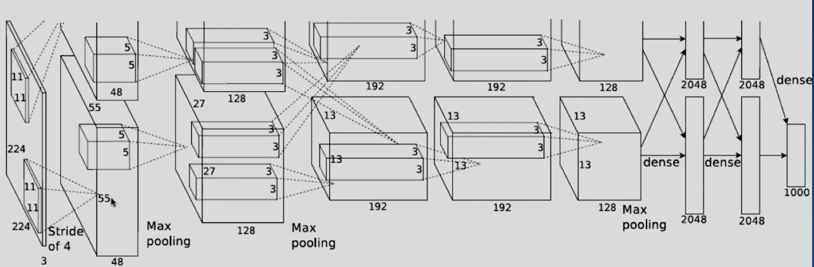

#### 第一个卷积层
- 输入224*224
- Stride = 4,卷积核 11*11
- 输出大小=(输出大小-卷积核+padding)/stride + 1 = 55
- 参数数目 = 3*(11*11)*96 = 35K

#### 首次使用Relu

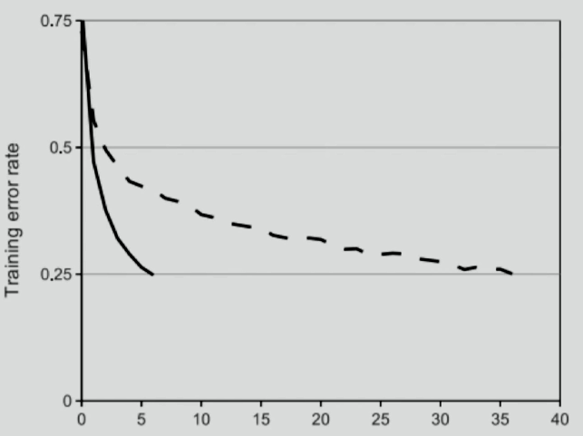

#### 特点

- 2-GPU并行结构
- 1，2，5卷积层后跟随max-pooling层
- 两个全连接层上使用了dropout技术
	- dropout：计算当前层某个神经元时，随机把上层某个神经元输出的值屏蔽为0
	- 全连接层参数站全部参数数目的大部分，容易过拟合‘
- Batch size = 128
- SGD momentum = 0.9
- Learing rate = 0.01，过一定次数后下降为原来的1/10
- 7个CNN做ensemble：18.2%->15.4%

### VGGNET
#### 网络结构
- 更深
- 多使用3x3的卷积核
	- 2个3x3的卷积层可以看做一层5x5的卷积层
	- 3个3x3的卷积层可以看做一层7x7的卷积层
- 1x1的卷积层可以看做是非线性变换
- 每次经过一个pooling层，通道数目翻倍
#### 视野域
- 视野域：2个3x3 = 1个5x5
- 2层比1层更多一次非线性变换
- 参数降低28%
  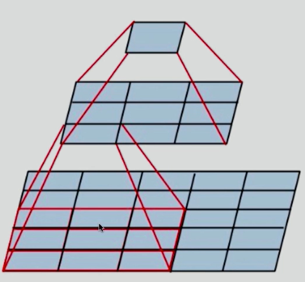

#### 技巧
- 先训练浅层网络，再利用浅层网络参数去训练深层网络
- 多尺度输入
	- 不同的尺度训练多个分类器，然后做ensemble
	- 随机使用不同的Feature Scaling然后输入进分类器进行训练


### Resnet
问题抛出  :模型深度达到某个程度后继续加深会导致训练集准确率下降
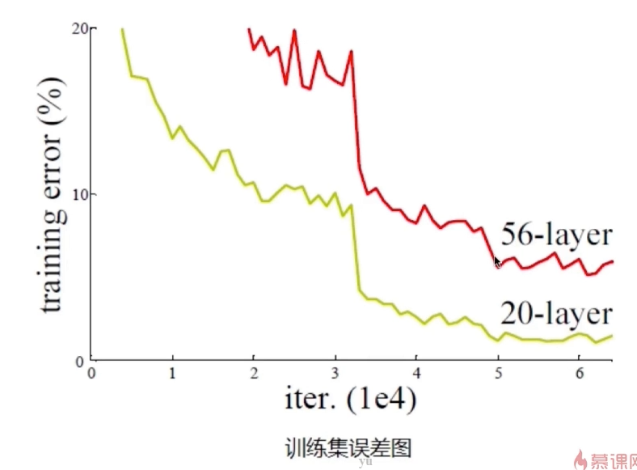


#### 加深层次的问题解决
- 假设：深层网络更难优化而非深层网络学不到东西
	- 深层网络至少可以和浅层网络持平
	- y=x,虽然增加了深度，但是误差不会增加
因此，ResNet采用了这样一种结构  

- Identity部分是恒等变换
- F(x)是残差学习

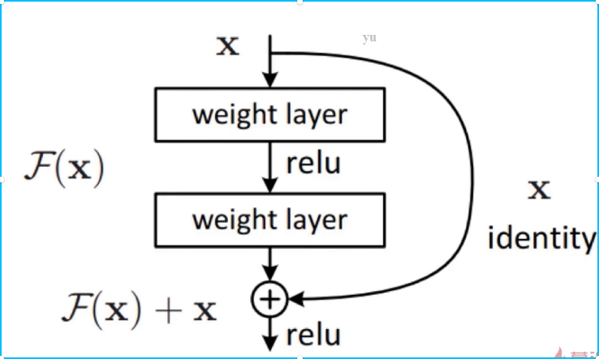

#### 模型结构
- Resnet-34 与 Resnet-101使用的子结构
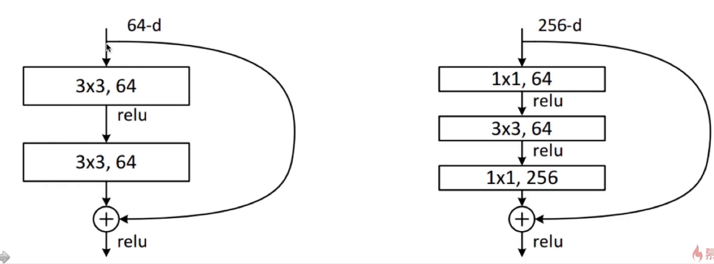
- 先使用一个普通的卷积层，stride = 2
- 再经过一个3x3的max_pooling
- 再经过残差结构
- 没有中间的全连接层，直接到输出
- 残差结构使得网络需要学习的知识变少，容易学习
- 残差结构使得每一层的数据分布接近，容易学习