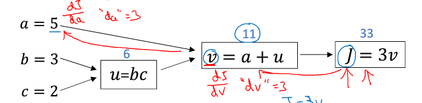
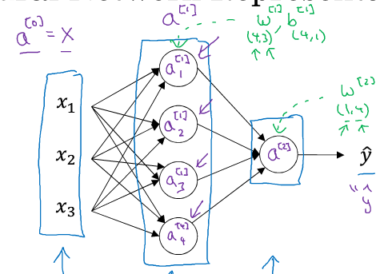
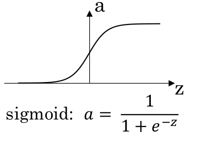
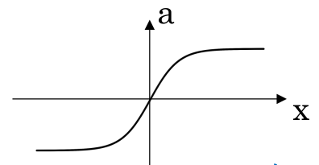
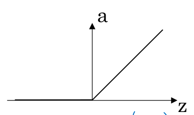
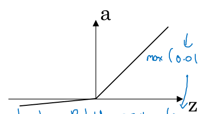
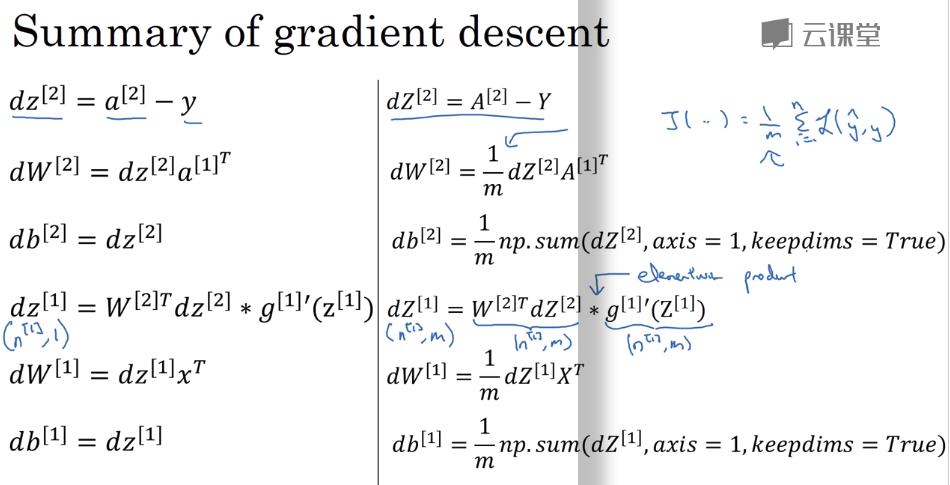

# 第三周机器学习

>     本文公式显示需要使用Mathjax，然后令人悲伤的是github不支持Mathjax
>     您可以将这篇md文件pull下来，使用您本地的markdown解析器解析
>     没有必要在公示显示上浪费时间，您也可以下载我本地生成的html用浏览器打开即可
>     或者您也可以下载我上传到github上的pdf
*[Mathjax开源项目地址](https://github.com/mathjax/MathJax)*

## 个人反馈

这是我学习机器学习第三周,一开始跟着视频老师学习vggnet和resner,发现听不懂,一方面是tensorflow的api函数我没有基础知识,另一方面是神经网络相关的基础知识不够扎实,因此我计划再次回到吴恩达老师的课程中去,吴恩达有一个专讲深度学习的视频,目前学习中....

## 再谈二分分类
- 对于输入矩阵$ X_{n \times m} $的理解:X为n行,m列的矩阵,可以理解为m个n维列向量,**n即代表单个输入向量的特征数,m即代表输入样本个数**,此时对于二分分类下的输出Y来说,Y是一个向量,维度为m.这里吴恩达老师将其定义为列向量,即Y表示为$ Y_{1 \times m} $  
- 关于logistic function 中 sigmoid(z)的z的表示有两种表示方法:
	- $ w^Tx+b $
	- $ \theta^T x ​$	

- cost function
  这里不使用误差平方作为cost function的原因是:该函数不是一个凸函数,即存在局部最值
  我们将 loss(error) function选用
$$
L(\hat y , y ) = -(y\log(\hat y)+(1 - y) \log(1-\hat y))
$$
我们将 cost function 定义为:
$$
J(w,b) = \frac{1}{m}\sum_{i=1}^{m}L(\hat y , y )
$$
### cost function的简单推导
我们令
$$
P(y=1|x) = \hat y \\\\
P(y=0|x) = 1- \hat y
$$
合并写法
$$
P(y|x) = \hat y ^{y}(1- \hat y)^{(1-y)}
$$
由于log是单调递增函数,因此我们可以用log(P)代替P,所以有
$$
\log (P(y|x)) = y \log (\hat y) + (1-y) \log (1- \hat y)  = - L(\hat y , y )
$$
这里我们根据极大似然估计的思想,假设m个训练样本iid  
那么有
$$
\log(P(labs in trainset)) = log(\Pi_{i=1}^m P(y(i)|x(i)) ) = \sum_{i=1}^m \log (P(y(i)|x(i))) = - \sum_{i=1}^m L(\hat y^{(i)},y^{(i)})
$$
我们为了让极大似然函数取最大,那么我们应该使得$ \sum_{i=1}^m \log (P(y(i)|x(i)))  $值要大一些,即loss function的累加值要小一些,从而我们定义 cost function:
$$
J(w,b) = \frac{1}{m} \sum_{i=1}^{m}L(\hat y,y)
$$
这也就证实了cost function计算出来的值越小越好.
### Computation Graph and Derivatives
$$
J(a,b,c) = 3(a+bc)
$$

其实计算图的出现是为了让我们更好的理解求偏导的过程:即复合函数求导(链式法则),进而为Backpropagation打下基础

Node:

> 编程习惯:变量da表示$ \frac{\partial J}{\partial a} ​$ 
在使用numpy定义向量时,不要使用1维的array表示向量,而是使用nx1的矩阵
举例: 
	a = np.random.randn(5) # X  
	a = np.random.randn((5,1)) # √

### 向量化

向量化的作用就是采用向量或者矩阵相乘的形式来代替for循环,从而加快运算速度.
但是GPU和CPU都含有并行化指令有时也叫SIMD（single instruction multiple data）指令。如果你使用这样的内置函数np.dot 或者np.functions,或者其它能让你去掉显式for循环的函数，这样python的numpy能够充分利用并行化能更加快速的计算这点对GPU和CPU上面计算都是成立的,GPU更加擅长SIMD计算但是CPU实际上也不差，只是没有GPU擅长而已。
实际编程的法则是只要有可能就不能显式的使用for循环。

## 再谈神经网络

### 一些符号定义和命名

在我们计算神经网络的层数时候,一般不包含输入层,因此上图给出的是一个2 Layer NN

这里定义一些符号  
$$
a^{[0]} = \vec x = \begin{bmatrix}
{
x_{1}^{[1]} \\\\
x_{2}^{[1]} \\\\
x_{3}^{[1]}
}
\end{bmatrix} \\\\
a^{[1]} = \begin{bmatrix}
{
a_{1}^{[1]} \\\\
a_{2}^{[1]} \\\\
a_{3}^{[1]} \\\\
a_{4}^{[1]}
}
\end{bmatrix} \\\\
a^{[2]}= \hat y \\\\
$$
下面一单个样本为例,展示各个向量之间的计算关系,这里采用$ w\text{与}b $来表示变量之间的线性关系

根据logistic regression中的基本关系式  
sigma函数可以看做一个activation function
$$
z = \vec w^T \vec x + b \\\\
\hat y = a = \sigma(z)
$$
我们以输入层到隐藏层为例,这里我们先不着急立马写出矩阵形式的表达式
先给出w的形式
$$
\vec w = \begin{bmatrix}
{
w_{1} \\\\
w_{2} \\\\
w_{3}
}
\end{bmatrix}
$$
即
$$
z_{1}^{[1]} =  (\vec w_1^{[1]})^T \vec x + b_1^{[1]} \\\\
a_1^{[1]} = \sigma(z_{1}^{[1]}) \\\\
z_{2}^{[1]} =  (\vec w_2^{[1]})^T \vec x + b_2^{[1]} \\\\
a_2^{[1]} = \sigma(z_{2}^{[1]}) \\\\
z_{3}^{[1]} =  (\vec w_3^{[1]})^T \vec x + b_3^{[1]} \\\\
a_3^{[1]} = \sigma(z_{3}^{[1]}) \\\\
z_{4}^{[1]} =  (\vec w_4^{[1]})^T \vec x + b_4^{[1]} \\\\
a_4^{[1]} = \sigma(z_{4}^{[1]}) \\\\

vec a_1的关系
$$

这里需要注意的$ \vec w_i^{[i]} $是一个三维的列向量,下面我们对上述过程进行向量化  
$$
\text{令}w_{4 \times 3}^{[1]} = \begin{bmatrix}
{
(\vec w_{1}^{[1]})^T \\\\
(\vec w_{2}^{[1]})^T \\\\
(\vec w_{3}^{[1]})^T \\\\
(\vec w_{4}^{[1]})^T
}
\end{bmatrix} \\\\
\text{令} \vec b^{[1]}_{4 \times 1} = \begin{bmatrix}
{
b_{1}^{[1]} \\\\
b_{2}^{[1]} \\\\
b_{3}^{[1]} \\\\
b_{4}^{[1]}
}
\end{bmatrix} \\\\
\text{令} \vec z^{[1]}_{4 \times 1} = \begin{bmatrix}
{
z_{1}^{[1]} \\\\
z_{2}^{[1]} \\\\
z_{3}^{[1]} \\\\
z_{4}^{[1]}
}
\end{bmatrix} \\\\
\text{那么我们得出}
\vec z_{4 \times 1} = w_{4 \times 3}^{[1]} \vec x_{3 \times 1} + \vec b^{[1]}_{4 \times 1} = w_{4 \times 3}^{[1]} \vec{a^{[0]}}_{3 \times 1} + \vec b^{[1]}_{4 \times 1} \\\\
\vec a^{[1]} = \sigma(\vec z^{[1]}) \\\\
\text{从而我们就得出了} \vec a^{[0]} \text{与} \vec a^{[1]}的关系
$$
同理,我们可以得出输出层与隐藏层的关系,这里需要注意的矩阵和向量的维度

### 多个样本时的向量化

这里我们将m个样本定义为  
$$
X_{n \times m} = [{\vec x^{(1)},\vec x^{(2)},...,\vec x^{(m)}}]
$$
这里我们设 $ A^{[0]} = X_{n \times m} $,由此我们推导$ A^{[0]}   $ 与 $ A^{[1]}   $的关系  
对于任意网络,设当前层的神经元个数为$ L_{i} $,设n为上一层神经元的个数
那么有  
$$
Z^{[1]}_{L_1 \times m} = W^{[1]}_{L_1 \times n}X_{n \times m} + b^{[1]}_{n \times m} \\\\
A^{[1]} = \sigma(Z^{[1]})
$$

### Activation function

Q:如果activation function是线性的会怎样?  
如果神经网络的各个层之间都是某个线性函数作为activation function,那么最终的输出与输入之间就化简为简单的线性关系,这样对于模型的拟合程度和简单线性回归没有任何区别,因此就需要activation function为非线性的.  
设activation fucntion为$ a=g(z) $  

1. sigmoid function
  sigmiod:
$$
a = \frac{1}{1 + e^{-z}}
$$

2. tanh

$$
a = tanh(z) = \frac{e^z-e^{-z}}{e^z+e^{-z}}
$$

  
the mean of the data is close to zero,thie actually makes learning for the next layer a little bit easier.  
在隐藏层中一般使用tanh function代替sigmoid function.  
在输出层,若希望 $ \hat y \in [0,1] ​$,那么仍然用sigmoid function  
3. Relu function(首选)
$$
a = relu(z) = \max(0,z)
$$
无论是sigmoid function还是tanh function,都有一个缺点:当z非常小的时候,函数斜率就会变得非常小,这样就会拖慢梯度下降,ReLU没有斜率接近于0的情况,尽管当z<0时,ReLU的斜率为0,但是在实践中,有足够多的隐藏单元令z>0

4 leaky Relu
$$
a = \max(0.01z,z)
$$

### Derivation of activation function

1. sigmoid
$$
g(z) = \frac{1}{1 + e^{-z}} \\\\
g'(z) = \frac{1}{1 + e^{-z}}\frac{e^{-z}}{1+e^{-z}} = \frac{1}{1 + e^{-z}}(1 - \frac{1}{1 + e^{-z}}) = g(z)(1-g(z))
$$

2. tanh
$$
g(z) = \frac{e^z - e^{-z}}{e^z + e^{-z}} \\\\
g'(z) = 1 - (g(z))^2
$$

3. ReLU
当z<0,$ g'(z) $ = 0  
当z>=0,$ g'(z) $ = 1

### Gradient descent for neural networks
以之前的2 Layer NN为例 
Paramters: $ w^{[1]}、b^{[1]}、w^{[2]}、b^{[2]} $  
cost funciton: $ J(w^{[1]},b^{[1]},w^{[2]},b^{[2]}) = \frac{1}{m}\sum_{i=1}^{m}h(\hat y,y) $

在执行梯度下降运算时，有这样几个参数需要注意：
$$
dw^{[1]} = \frac {\partial J}{\partial w^{[1]}} \\\\
db^{[1]} = \frac {\partial J}{\partial b^{[1]}} \\\\
dw^{[2]} = \frac {\partial J}{\partial w^{[2]}} \\\\
db^{[2]} = \frac {\partial J}{\partial b^{[2]}} \\\\
$$
关键在这些参数如何去求得，下面先给出这类公式：
我们先给出Forward Propagation的例子  
$$
Z^{[1]} = W^{[1]}X + b^{[1]} \\\\
A^{[1]} = g^{[1]}(Z^{[1]}) \\\\
Z^{[2]} = W^{[2]}A^{[1]} + b^{[2]} \\\\
A^{[2]} = g^{[2]}(Z^{[2]})
$$
然后写出Back Propagation：  
$$
dZ^{[2]} = A^{[2]} - Y (\text{Y是1xm的矩阵 }) \\\\
dW^{[2]} = \frac{1}{m} dZ^{[2]} (A^{[1]})^T \\\\
db^{[2]} = \frac {1}{m} np.sum(dZ^{[2]},axis = 1,keepdims = True) \\\\
dZ^{[1]} = (W^{[2]})^T dZ^{[2]} .\times g^{[1]}{'}(Z^{[1]}) (\text{这里的点乘表示矩阵里的每个对应元素相乘}) \\\\
dW^{[1]} = \frac{1}{m} dZ^{[1]} X^T \\\\
db^{[1]} = \frac {1}{m} np.sum(dZ^{[1]},axis = 1,keepdims = True)
$$

