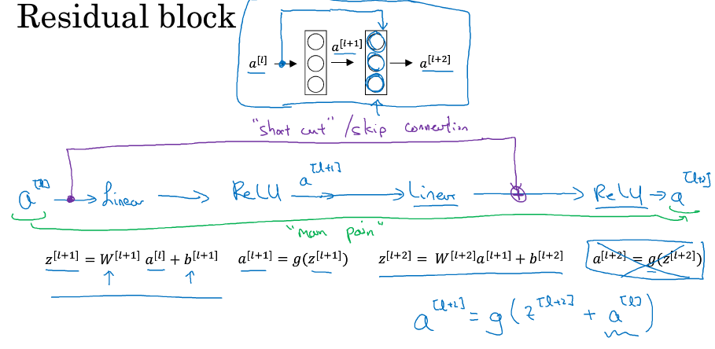
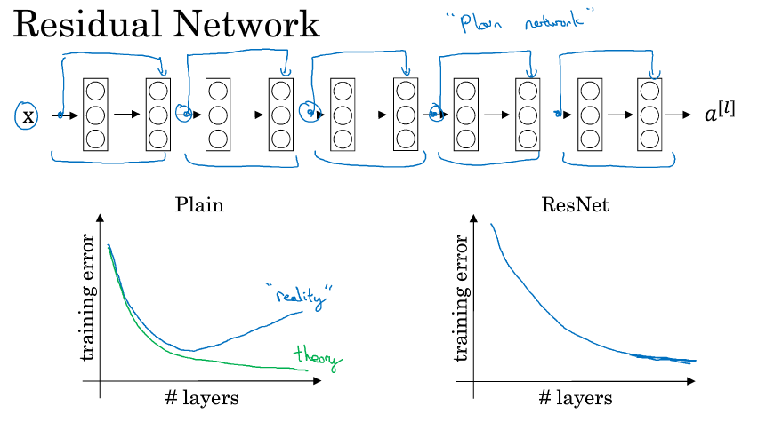

<script type="text/x-mathjax-config">
    MathJax.Hub.Config({
        tex2jax: { inlineMath: [['$','$'], ['$ ',' $']], processClass: 'math', processEscapes: true },
        'HTML-CSS': { linebreaks: { automatic: true } },
        SVG: { linebreaks: { automatic: true } }
        });
</script>
<script src="https://mathjax.cnblogs.com/2_7_2/MathJax.js?config=TeX-AMS-MML_HTMLorMML"></script>

# 第四周机器学习


>     本文公式显示需要使用Mathjax，然后令人悲伤的是github不支持Mathjax
>     您可以将这篇md文件pull下来，使用您本地的markdown解析器解析
>     没有必要在公示显示上浪费时间，您也可以下载我本地生成的html用浏览器打开即可
>     或者您也可以下载我上传到github上的pdf
>     *[Mathjax开源项目地址](https://github.com/mathjax/MathJax)*

## Regularizing your nerual network

### Dropout regularization
从每层神经元中随机delete一些节点，以及忽略与之相连的关系网络  

eg. Inverted dropout（每一次迭代训练都会这么做一次）
```Python
# t3表示一个裁剪工具 keep_prob 即保留多少网络（百分比表示），即保留某个隐藏单元的概率
t3 = np.random.rand(*a3.shape)<keep_prob
a3 = np.multiply(a3,d3) # a3 .*= d3
a3 /= keep_prob #确保a3期望不变
```

Note:  

>     在测试与交叉验证阶段不需要dropout 即 将keep_prob设置为1
>     Dropout regularization 主要应用于计算机视觉领域，其余领域如果没有出现过拟合的情况，一般不使用dropout

### 其他防止数据过拟合的方法

- 增加数据
  eg.如果没有更多的数据，可以采用一些特殊方式生成，比如在computer vision领域，图像可以采用水平镜像的方式得到另一个数据
- early stoping
  在迭代计算中，training error会一直下降 dev set error 会先上升后下降，在两个都下降的最后时刻停止迭代获取模型，这种方案是一个折中方案。

## Normalize inpurts


$$
\mu  = \frac{1}{m}\sum_{i=1}^m X^{(i)} \\\\
X := X- \mu \\\\
\sigma^2 =  \frac{1}{m} \sum_{i=1}^m (X^{(i)})^2 \\\\
X /= \sigma^2
$$

## Vanishing/exploading gradients

在训练神经网络时候，若有一些样本恰好在计算中都位于activation function的线性区，那么$ \hat y $的值将会呈现指数级的倍增或者倍减，从而导致梯度呈现爆炸式或者悬崖跌落是的现象，从而影响训练深层神经网络

## 在深层网络中如何初始化权重参数

在输入层和下一层之间
$$
z = w_1 x_1 + w_2 x_2 + ... + w_n x_n \\\\
w_i = \frac{1}{n}
$$
在$l$层
$$
w^{[l]} = np.random.randn(shape) * np.sqrt(\frac{1}{n^{[l-1]}}) \text{(Note:这里shape是两个参数，或者对tuple进行拆包)}
$$
如果使用的是Relu 函数，使用 $ \frac{2}{n} $会更好一些  
如果激活函数使用的是 tanh，使用$ \sqrt{\frac{1}{n^{[l-1]}}} $


## Mini-Batch梯度下降
以 输入样本X有500万个为例
$$
X = \lbrace X^{(1)},X^{(2)},X^{(3)},...,X^{(1000)},|X^{(1001)},X^{(1002)},...,X^{(2000)},| \cdots | ... X^{(500w)} \rbrace
$$
这里将500万个数据分成了5000个mini-batch，同时也需要将Y按照与X对应的方式分组
$$
X^{\lbrace t \rbrace} 大小 (n_x,1000) \\\\
Y^{\lbrace t \rbrace} 大小 (1,1000)
$$
具体训练方式用伪代码表示：
$$
for t = 1,...,5000:  \\\\
	Forward prop on X^{\lbrace t \rbrace} \\\\
		Z^{[l]} = W^{[l]}X^{\lbrace t \rbrace} + b^{[l]} \\\\
		A^{[l]} = g^{[l]}(Z^{[l]}) \\\\
		\vdots \\\\
		A[L] = g^{[L]}(Z^{[L]}) \\\\
`	Compute cost J = \frac{1}{1000} \sum_{i=1}^{l} L({\hat y}^{(i)},y^{(i)})+\frac{\lambda}{2x1000}\sum {||w^{[l]}||}^2    \ \ \ (Note:y^{(i)} from X^{\lbrace t \rbrace},Y^{\lbrace t \rbrace}) \\\\
	Backprop to compute gradient with J^{\lbrace t \rbrace} (using X^{\lbrace t \rbrace},Y^{\lbrace t \rbrace})) \\\\
	w^{[l]} := w^{[l]} - \alpha dw^{[l]} \\\\
	b^{[l]} := b^{[l]} - \alpha db^{[l]}
$$
在Batch gradient descent中 $ J(\theta) $一定会随着迭代次数的增加而减小，但是在Mini-Batch gradient descent 中从局部来看是不一定的

Note:
>     If mini-batch size = m:Batch gradient descent
>     If mini-batch size = 1:Stochastic gradient descent（随机梯度下降）

### mini-batch的选取案例
if small training set：Use batch gradient descent  
Typical mini-batch size:64,128,256,512  
Make sure minibatch fit in CPU/GPU mem

## 梯度下降的高级算法

### 指数加权平均
给出递推公式
$$
V_0 = 0
V_t = \beta V_{t-1} + (1-\beta)\theta_t
$$
$\theta_t$为输入，这里以每日的气温为例  
$$
V_t \approx average on \frac{1}{1-\beta} day's temperature
$$
$ \beta $越大，$ V_t $变化越小，$ v_t $曲线较为平缓  
$$
\beta = 0.9 \approx 10 days
\beta = 0.98 \approx 50 days
\beta = 0.5 \approx 2 days
$$
$ V_t $在统计学中称为moving average in the statistics literature(指数加权平均值)  

下面看这样一个推导:  
$$
\begin{equation}\begin{split}
V_3 &= \beta V_2 + (1-\beta)\theta_3 \\\\
&= (1-\beta)\theta_3 + \beta((1-\beta)\theta_2 + \beta V_1) \\\\
&= (1-\beta)\theta_3 + \beta((1-\beta)\theta_2) + \beta^2 (1-\beta)\theta_1
\end{split}\end{equation}
$$
由上式可见 $ \beta $ 是一个衰减项，使得过去值影响当前变化值，若 $ \beta = 0.9 $时，那么$ \beta^10 \approx 0.33 \approx \frac{1}{e}  $  
因此称当$ \beta = 0.9 $时，$ V_t $约等于近十日加权平均值


### 指数加权平均值的偏差修正
解决 $ V_1 = (1-\beta)\theta_0 $问题，即这样运算会导致一开始前几项会很小  
这里我们可以令 
$$
V_t := \frac{V_t}{1-\beta^t}
$$
eg.$ V_2 := \frac{V_2}{1-\beta^2} = \frac{V_2}{1-0.98^2} = \frac{V_2}{0.0396}  $
当t很大时，$ \beta^t $趋向于0，因此偏差修正项不再起作用。  
偏差修正能够在早期就能获得更好的估测

### Gradient descent with momentum
伪代码展示：
$$
\begin{equation}\begin{split}
On\ iteration\ t: \\\\
	&Compute\ dw,db\ on\ current\ mini-batch \\\\
	&V_{dw} = \beta V_{dw} + (1-\beta) dw \\\\
	&V_{db} = \beta V_{db} + (1-\beta) db \\\\
	&w := w - \alpha V_{dw} \\\\
	&b := b - \alpha V_{db}
\end{split}\end{equation}
$$
这样就可以减缓梯度下降的频率，一般取$ \beta $为0.9，这里不关心初代$ V_{dw}、V_{db} $ 的值，因此不需要偏差修正。  

### RMSProp （root mean square prop）

$$
\begin{equation}\begin{split}
On\ iteration\ t: \\\\
	&Compute\ dw,db\ on\ current\ mini-batch \\\\
	&S_{dw} = \beta S_{dw} + (1-\beta) (dw)^2 \\\\
	&S_{db} = \beta S_{db} + (1-\beta) (db)^2 \\\\
	&w := w - \alpha \frac{dw}{\sqrt{S_{dw}} +\epsilon } \\\\
	&b := b - \alpha \frac{db}{\sqrt{S_{db}} +\epsilon }
\end{split}\end{equation}
$$
此时 $ \alpha $可以取较大值，为了确保无除0操作，加上$ \epsilon $项，一般$ \epsilon $取$ 10^{-8} $,取$ \beta $为0.999

### Adam optimization algorithm
Adam put momentum and RMSprop together  
$$
V_{dw} = 0,S_{dw} = 0,V_{db} = 0,S_{db} = 0
$$
$$
\begin{equation}\begin{split}
On\ iteration\ t: \\\\
	&Compute\ dw,db\ on\ current\ mini-batch \\\\
	&V_{dw} = \beta_1 V_{dw} + (1-\beta_1) dw \\\\
	&V_{db} = \beta_1 V_{db} + (1-\beta_1) db \\\\
	&S_{dw} = \beta_2 S_{dw} + (1-\beta_2) (dw)^2 \\\\
	&S_{db} = \beta_2 S_{db} + (1-\beta_2) (db)^2 \\\\
	&V^{corrected}_{dw} = \frac{V^{corrected}_{dw}}{1 - \beta_1^{t}},V^{corrected}_{db} = \frac{V^{corrected}_{db}}{1 - \beta_1^{t}}  \\\\
	&S^{corrected}_{dw} = \frac{S^{corrected}_{dw}}{1 - \beta_1^{t}},S^{corrected}_{db} = \frac{S^{corrected}_{db}}{1 - \beta_1^{t}}  \\\\
	&w := w - \alpha \frac{V^{corrected}_{dw}}{\sqrt{S^{corrected}_{dw}} +\epsilon } \\\\
	&b := b - \alpha \frac{V^{corrected}_{db}}{\sqrt{S^{corrected}_{db}} +\epsilon } \\\\
\end{split}\end{equation}
$$
各个参数的典型值
$$
\alpha : need\ to\ be\ tune \\\\
\beta_1 : 0.9 \\\\
\beta_2 : 0.999 \\\\
\epsilon : 10^{-8}
$$
Adam:Adaptivbe moment estimation

### Laernging rate decay
将学习率设计成一个随着自变量（比如迭代次数$ \alpha $)下降的函数
### 超参数调试、
目前参数有 $\alpha、\beta、\#layers、\#hidden units、learning\ rate\ decay、mini-batch\ size$  
在选用参数1与参数2调试时，需要在一个矩形区域内随机选点，而不是用网格上的点。  
然后在大致确定一个区域，再从这个区域中继续随机选点，直到参数达到要求。  
对于一些特定参数比如 $ \alpha $  
$ \alpha $ 在取 0.0001~1之间取数值时m要使用对数坐标划分，即0.0001、 0.001、 0.01、 0.1、 1这几个值，然后进一步缩小范围  
伪代码举例：

```Python
r = -4 * np.random.rand()
a = 10 ** r
```

### Batch Normalization
对$ a^{[l]} $进行normalization，方法与对X进行normalization相同，实践中更多的是对$ z^{[l]} $进行归一化处理。  
设$ z^{[l]} $化为m个n维列向量，设z有n个特征（z矩阵 n行 m列）
$$
\mu = \frac{1}{m} np.sum(z^{[l]},axis = 1)  \\\\
(Note：这里\mu 是一个n维列向量，直观理解就是对Z矩阵的各行取平均值，然后将值放回\mu 矩阵)  \\\\
\sigma^2 =  \frac{1}{m} np.sum((z^{(l)} - \mu) .* (z^{(l)} - \mu),axis = 1)\\\\
(Note：这里(z^{(l)} - \mu)涉及到python中的广播，\\\\ 
(z^{(l)} - \mu) .* (z^{(l)} - \mu)得到是一个与z形状大小相同的矩阵，\sigma^2是一个n维列向量)  \\\\
z^{(l)}_{norm} = \frac{z^{(l)} - \mu}{\sqrt{\sigma^2 + \epsilon}}
$$
$ \epsilon $ 的存在是为了防止zero division  
$$
{\widetilde{z}}^{(l)} = \gamma z^{(l)}_{norm} + \beta
$$
$ \gamma $ 和 $ \beta $存在的意思是可任意设定$ {\widetilde{z}}^{(l)} $的均值

下面说明下归一化的过程
$$
X \stackrel{w^{(l)},b^{(l)}}{\longrightarrow} Z^{[l]} \stackrel{\beta^{(l)},\gamma^{(l)}}{\longrightarrow} {\widetilde{z}}^{(l)} \longrightarrow a^{[l]}
$$
归一化可以使每一层的神经网络独立性加强

## 多分类问题 softmax regression
对于多分类问题，$ \vec{\hat y} $应该输出多分类和各个分类的概率，根据概率性质应该满足$ \sum{\vec{\hat y}} = 1 $  
对于最后一层(层L)来说，运用softmax regression:  
$$
Z^{[L]} = W^{[l]}a^{[L-1]} + b^{[L]} \\\\
Activation function  \\\\
\vec t = e^{z^{[l]}} \\\\
\hat y = a^{[l]} = \frac{ e^{z^{[l]}} }{ \sum{\vec{t}} }
$$

#### training step
eg 
$$
\vec y = 
\begin{pmatrix} 
0 \\\\
1 \\\\
0 \\\\
0 
\end{pmatrix},
\vec{\hat y} =
\begin{pmatrix} 
0.3\\\
0.2\\
0.1\\
0.4
\end{pmatrix}
$$
loss function:  
$$
\begin{equation}\begin{split}
L(\vec y,\vec{\hat y}) &= -\sum_{j=1}^4 y_j \log(\hat y_j) \\\\
&= -y_2 \log(\hat y_2) \\\\
&= -\log{\hat y_2}
\end{split}\end{equation}
$$
如果预测正确  
$ \hat y_2 \to 1,L(\vec y,\vec{\hat y}) \to 0 $  
如果预测错误  
$ \hat y_2 \to 0,L(\vec y,\vec{\hat y}) \to \infty  $  

cost function:  
$$
J(w^{[1]},b^{[1]},...) = \frac{1}{m} \sum_{i=1}^{m} L({\hat y}^{(i)},y^{(i)})
$$

Backprop关键一步:
$$
\frac{\partial J}{\partial z^{(L)}} = dz^{(L)} = \hat y - y
$$


## 卷积神经网络

### 边缘检测
介绍几种卷积核
- 垂直边缘检测
  <table border="1">
    <tr>
      <td>1</td>
      <td>0</td>
      <td>-1</td>
    </tr>
    <tr>
      <td>1</td>
      <td>0</td>
      <td>-1</td>
    </tr>
    <tr>
      <td>1</td>
      <td>0</td>
      <td>-1</td>
    </tr>
  </table>
- 水平边缘检测
  <table border="1">
    <tr>
      <td>1</td>
      <td>1</td>
      <td>1</td>
    </tr>
    <tr>
      <td>0</td>
      <td>0</td>
      <td>0</td>
    </tr>
    <tr>
      <td>-1</td>
      <td>-1</td>
      <td>-1</td>
    </tr>
  </table>


- Sober filter
  <table border="1">
    <tr>
      <td>1</td>
      <td>0</td>
      <td>-1</td>
    </tr>
    <tr>
      <td>2</td>
      <td>0</td>
      <td>-2</td>
    </tr>
    <tr>
      <td>1</td>
      <td>0</td>
      <td>-1</td>
    </tr>
  </table>


### Padding
问题：边角的像素在传统卷积运算中参与的机会较少，因此加入padding运算，弥补这一个缺点。

设原图大小为n*n，p为Padding大小，f为卷积核大小  
要得到与原输入相同大小图像，则需有 n+2p-f+1 = n=>$ p = \frac{f-1}{2} $  
这也解释了为什么卷积核大小都是奇数

### 卷积步长  
卷积步长：即卷积核每次向右移动几列像素
图像nxn f*f卷积核 padding大小p  stride:s
那么输出图像大小：  
w$ \times $h = 
$$
\lfloor \frac{n + 2p -f}{s} + 1 \rfloor\times \lfloor \frac{n + 2p -f}{s} + 1 \rfloor
$$

### Summary of notation  
If layer l is a convolution layer  
$ f^{[l]} $ = filter size  
$ p^{[l]} $ = padding
$ s^{[l]} $ = stride  
$ n_c^{[l]} $ = number of filters  
Input: $ n_h^{[l-1]} \times n_w^{[l-1]} \times n_c^{[l-1]} $
Output: $ n_h^{[l]} \times n_w^{[l]} \times n_c^{[l]} $
Each filter is: $ f^{[l]} \times f^{[l]} \times n_c^{[l-1]} $  
Activation:  
$$
a^[l] \to n_h^{[l]} \times n_w^{[l]} \times n_c^{[l]} \\\\
A^{[l]} \to m \times n_h^{[l]} \times n_w^{[l]} \times n_c^{[l]}
$$
Weight: $ f^{[l]} \times f^{[l]} \times n_c^{[l-1]} \times n_c^{[l]} $
bias: $ n_c^{[l]} - (1 \times 1 \times 1 \times n_c^{[l]})$ 
Convolution(Conv) : 卷积
Pooling（Pool）：池化  
Fully connected(FC)：全连接  
Note:bias 对于 n_c^{[l]}个通道而言共享  

### Pooling layer
- Max pooling
- Average pooling
Pooling与convolution不同的在于，如果input为多通道，则pooling会对每个通道计算pooling，输出为多通道  
Input:$ n_h \times n_w \times n_c $
Output:$ \lfloor \frac{n_H - f}{s} + 1 \rfloor \times \lfloor \frac{n_H - f}{s} + 1 \rfloor \times n_c $  
在计算神经网络层数时，一般不计算池化层，或者将池化层与卷积层合在一起计算。  

### Case Study
- Classtic networks 
	- LeNet-5 （1998在池化层后引入了sigmoid non-linearity）
	- Alexnet (Relu)
	- VGG (VGG-16、VGG-19)
- ResNet
- Inception

#### Resnet
1. Residual block

   

   主要是理解公式，这里可以看出要求$ a^{[l]} $ 与 $ z^{[l+2]} $这两个矩阵大小要相同

   

#### 1x1 convolution

对于多通道而言，1x1 convolution可以认为是对多个通道上像素点进行全连接

### 数据扩充（针对图片）
- Mirror
- Random Cropping
- Color shifting
	- PCA


