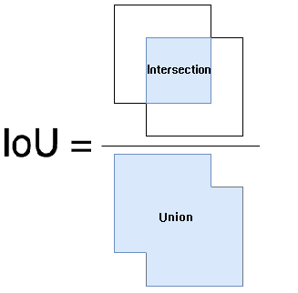
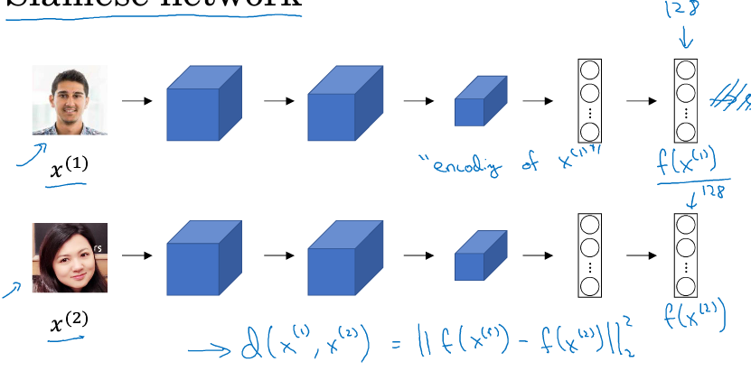
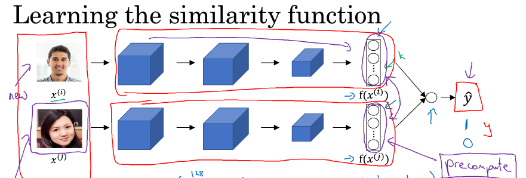

# 第五周机器学习

>     本文公式显示需要使用Mathjax，然后令人悲伤的是github不支持Mathjax
>     您可以将这篇md文件pull下来，使用您本地的markdown解析器解析
>     没有必要在公示显示上浪费时间，您也可以下载我本地生成的html用浏览器打开即可
>     或者您也可以下载我上传到github上的pdf
>     *[Mathjax开源项目地址](https://github.com/mathjax/MathJax)*

## Object Dection
### Object location
在目标定位时，我们先仅考虑图片中仅有一个目标的问题。  
比如目标有：行人、车、其他情况  
则我们可以采用监督学习机制，举例：
$$
\vec y = 
\begin{pmatrix} 
p_c \\\\
b_x \\\\
b_y \\\\
b_h \\\\
b_w \\\\
c_1 \\\\
c_2 
\end{pmatrix},
$$
$ p_c = 1$表示找到目标，0表示未找到
$ b_x、b_y、b_h、b_w $为目标位置参数  
$ c_1 = 1 $代表行人  
$ c_2 = 2 $代表车  
那么loss function该如何定义呢？  
$$
L(\hat y,y) = 
\begin{cases} 
(\hat y_1 - y_1)^2 + (\hat y_2 - y_2)^2 + ... +  (\hat y_7 - y_7)^2 , if \ y_1 = 1 \\\\
(\hat y_1 - y_1)^2  , if\ y_1 = 0
\end{cases}
$$

###  Landmark detection （特征点检测）
比如人脸识别，要把眼睛位置用几个点标记出来  
则这些点成为特征点  
Note:
>     所标注的这些点必须统一特征
>     举例：
>     特征点1 表示左眼的外眼角
>     特征点2 表示左眼的内眼角

### 目标检测
以不同大小矩形框在图像上滑动，当做目标定位的神经网络输入

### 卷积的滑动窗口实现

- 预备知识-吧全连接层转换为卷积层
- 步骤
  把全连接层转换为卷积层，然后直接将整个图像作为输入，最后得到的结果是一个多维输出（相当于滑动窗口裁剪图像生成的结果的组合）

### Eveluating object location
IoU 的全称为交并比（Intersection over Union），通过这个名称我们大概可以猜到 IoU 的计算方法。IoU 计算的是 “预测的边框” 和 “真实的边框” 的交集和并集的比值。

### Non-max suppression
面向问题：目标定位算法可能对同一个对象做出多次检测  
Non-max suppression可以确保算法对每个对象检测一次，对目标对象检测时，检测算法可能会对同一个对象输出多个检测值，Non-max suppression的策略是对在检测出来的矩形框有交集的检测结果取最大值

### Anchor box
面向问题：每个各自只能检测出一个对象  
例如：当人站在车前面时，如何区分人和车？
答：更改输入y的结构，用y表示两列的值，这样一个各自就可以输出多个对象  

## 人脸检测
### One-shot learning 
挑战：learning from one example to recognize the person again  
解决方案：Learning a "similarity" function.  (训练出一个相似度网络)
d(img1,img2) = degree of difference between images  
If d(img1,img2) <= 阈值 "same"，else "different"

### Siamese network

Parameters of NN define an encoding f($ x^{(i)} $)
Learning parameters so that:  
If $ x^{(i)} $ are the same person,$ {|| f(x^{(i)}) - f(x^{(j)}) ||}^2 $ is small  
If $ x^{(i)} $ are different persons,$ {|| f(x^{(i)}) - f(x^{(j)}) ||}^2 $ is large  

### Triplet loss
为了训练Siamese network，我们需要定义一个损失函数，因此引入了Triplet loss  
$ {|| f(A) - f(P) ||}^2 - {|| f(A) - f(N) ||}^2 + \alpha <= 0  $
$ \alpha $:margin  
Given 3 images ,A,P,N
$$
L(A,P,N) = \max({|| f(A) - f(P) ||}^2 - {|| f(A) - f(N) ||}^2 + \alpha,0)
$$

$$
J = \sum_{i=1}^{m}L(A^{(i)},P^{(i)},N^{(i)})
$$
一般情况下，我们在取Negative set时候，尽量与A Set相差的小一些，这样可以便于"hard" to train，从而可以较好的训练出一个精确度较高的模型

### Face verification and binary classification
除了Siamese network方法  

我们可以类比于二分类问题，训练出一个网络直接输出0,1，比如0表示两张图片是同一个人  
这时，
$$
\hat y = \sigma (\sum_{k=1}^{128} w_i | f(x^{(i)})_k -  f(x^{(j)})_k | + b)
$$
$ | f(x^{(i)})_k -  f(x^{(j)})_k |  $也可以被替换为
$$
\frac { ( f(x^{(i)})_k -  f(x^{(j)})_k )^2 } {  f(x^{(i)})_k +  f(x^{(j)})_k  }
$$
这个式子称为$ \chi $平方公式($ \chi $平方相似度)

